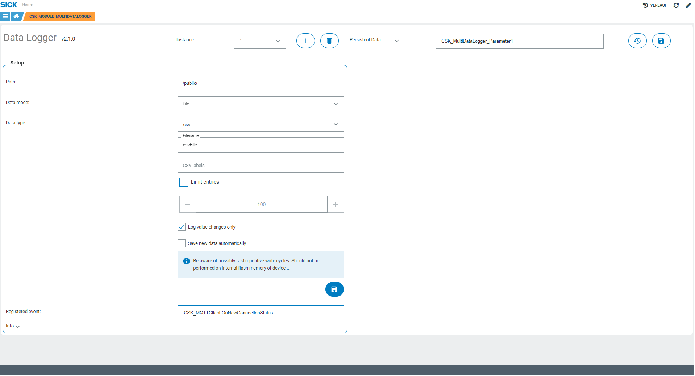

# CSK_Module_MultiDataLogger

Module to store data like files (json, csv) or images.

## How to Run

The module includes an intuitive GUI to setup the instances of the data logger.  
For further information regarding the externally available functions / events, please check out the [documentation](https://raw.githack.com/SICKAppSpaceCodingStarterKit/CSK_Module_MultiDataLogger/main/docu/CSK_Module_MultiDataLogger.html) in the folder "docu".

## Information

Tested on:
|Device|Firmware|Module version|
|--|--|--|
|SIM1012|v2.4.1|v1.0.0|
|SICK AppEngine|v1.5.0|v1.0.0|
|SICK AppEngine|v1.3.2|v1.0.0|

This application / module is part of the SICK AppSpace Coding Starter Kit developing approach.  
It is programmed in an object-oriented way. Some of the modules use kind of "classes" in Lua to make it possible to reuse code / classes in other projects.  
In general, it is not neccessary to code this way, but the architecture of this app can serve as a sample to be used especially for bigger projects and to make it easier to share code.  
Please check the [documentation](https://github.com/SICKAppSpaceCodingStarterKit/.github/blob/main/docu/SICKAppSpaceCodingStarterKit_Documentation.md) of CSK for further information.  

## Topics

Coding Starter Kit, CSK, Module, SICK-AppSpace, Data, Images, Save, Store
